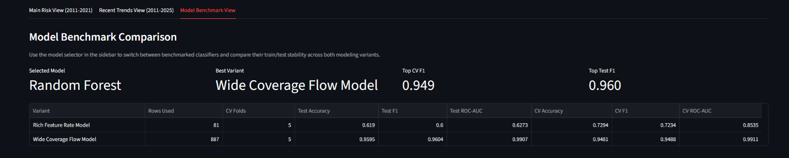

# Turkiye Socio-Economic Justice Risk Analysis

Province-level socio-economic analysis and justice-risk modeling project for Turkiye, built with official public datasets, multi-model machine learning benchmarks, and an interactive Streamlit dashboard.

## Overview

This project examines how province-level socio-economic indicators relate to recorded justice-file intensity across Turkiye.

The system brings together:

- provincial justice investigation statistics
- SGK active insured counts
- internal migration indicators
- province-level education indicators from TURKSTAT and MEB
- model benchmarking with Logistic Regression, Random Forest, and XGBoost
- an interactive dashboard for province, year, and model comparison

The project does **not** claim to measure absolute crime truth directly.  
Its analytical target is a **justice proxy** derived from recorded investigation-file activity.

## Objective

The central analytical question is:

> Can province-level socio-economic indicators help explain or classify recorded justice-file intensity across Turkish provinces?

To answer that question, the repository constructs province-year datasets, engineers socio-economic features, benchmarks multiple classification models, and exposes the results through a decision-support style dashboard.

## Data Scope

The harmonized core modeling window is:

- `2011-2021`

This period was selected because it provides the cleanest overlap between justice and socio-economic sources at the province-year level.

### Primary Data Sources

- `Justice`: provincial investigation-file statistics, `2011-2021`
- `SGK`: active insured totals, `2009-2024`
- `Migration`: in-migration, out-migration, net migration, province population
- `TURKSTAT education`: attainment-style indicators for recent years
- `MEB education`: province-level gross enrollment ratios for upper secondary education, `2011-2025`

### Core Feature Groups

- `active_insured_total`
- `population`
- `in_migration`, `out_migration`, `net_migration`
- `general_secondary_gross_enrollment_rate`
- `vocational_secondary_gross_enrollment_rate`
- `illiterate_rate`
- `university_rate`
- region-based categorical indicators

### Interpretation Note

MEB education variables in this repository are **gross enrollment rates**, not attainment rates.

This means:

- values may exceed `100`
- they should be interpreted as participation or enrollment-intensity proxies
- they should not be interpreted as direct graduation or attainment outcomes

### Data Governance

The repository includes only the compact, aggregated runtime artifacts required to reproduce the dashboard experience after cloning. These files are province-year level public indicators and model outputs; they do not contain individual-level records or personally identifiable information.

Larger source files and local exploratory data dumps are intentionally excluded through `.gitignore`. When extending the project, raw source archives should be regenerated from the documented public sources or handled outside the repository unless redistribution terms are explicitly clear.

## Modeling Strategy

The repository currently benchmarks two complementary modeling variants:

### 1. Rich Feature Rate Model

- narrower overlap
- richer socio-economic feature space
- suited to detailed but lower-coverage analysis

### 2. Wide Coverage Flow Model

- broader temporal coverage
- stronger province-year support across `2011-2021`
- currently the stronger general-purpose baseline for broad monitoring

## Methods

The project currently uses the following data science and machine learning methods:

- province-year panel construction from multiple public sources
- province-name normalization and schema harmonization
- feature engineering for justice, migration, employment, population, and education variables
- proxy-target modeling using recorded investigation-file intensity
- binary classification based on yearly relative justice-flow thresholds
- benchmark modeling with `Logistic Regression`, `Random Forest`, and `XGBoost`
- numeric and categorical missing-value imputation
- feature scaling for linear models
- one-hot encoding for regional categorical variables
- stratified train/test evaluation
- stratified cross-validation for stability checks
- out-of-fold prediction export for dashboard-safe probability display

## Model Benchmarking

`src/train.py` benchmarks multiple classifiers for both modeling variants and exports reproducible evaluation artifacts.

For each model variant, the training pipeline performs:

- a stratified train/test split
- stratified cross-validation with up to `5` folds
- reporting for accuracy, balanced accuracy, precision, recall, F1, and ROC-AUC
- confusion matrix and detailed classification output generation
- out-of-fold prediction generation for dashboard overlays

Generated benchmark artifacts include:

- `models/benchmark_summary.csv`
- `models/benchmark_results.json`
- `models/model_predictions.csv`

This benchmark structure makes it possible to compare simple linear baselines against tree-based models while keeping the dashboard aligned with safer, non-in-sample probability outputs.



The benchmark view is intended for model comparison rather than only presentation. It allows users to inspect how Logistic Regression, Random Forest, and XGBoost perform across variants, making the analytical workflow more defensible and easier to explain in portfolio or review settings.

## Dashboard

The Streamlit dashboard is designed as an analytical interface rather than a static report.

It currently supports:

- province and year filtering
- benchmark model selection
- modeling variant selection
- province-level justice and socio-economic summary cards
- province trend analysis
- choropleth-based provincial risk visualization
- ranked province comparison for the selected year
- recent post-2021 monitoring views
- a dedicated model benchmark comparison view

When benchmark artifacts are available, the dashboard can switch between saved model overlays. In that mode, the displayed risk labels, ranking table, probability cards, and map coloring are driven by saved **out-of-fold** model predictions rather than in-sample fitted probabilities.

### Dashboard Overview


The main dashboard view combines province filters, model-aware summary cards, justice activity signals, and socio-economic context into a single operational overview. This section is designed to provide a fast province-level read before moving into deeper map, ranking, or benchmark analysis.

### Province Risk Map


The province risk map visualizes the currently selected model overlay at the national level. It enables quick spatial comparison across provinces and helps surface regional concentration patterns in predicted justice-risk intensity.

### Ranking and Coverage


The ranking and coverage section highlights how provinces compare within the selected year while also exposing the breadth of the modeling base. This supports both relative benchmarking and transparency around the dataset coverage behind the dashboard.

## Project Structure

```text
.
|-- app.py
|-- requirements.txt
|-- README.md
|-- data/
|   |-- external/
|   |-- raw/
|   `-- processed/
|-- docs/
|   |-- data_sources.md
|   |-- dataset_inventory.md
|   |-- raw_data_plan.md
|   `-- processed_data_plan.md
|-- models/
|-- notebooks/
|-- reports/
|   `-- figures/
|-- src/
|   |-- config.py
|   |-- merge_master_data.py
|   |-- prepare_raw_data.py
|   |-- source_inventory.py
|   `-- train.py
`-- tests/
```

## Getting Started

Create and activate a virtual environment:

```bash
git clone <repository-url>
cd Turkiye-Socioeconomic-Justice-Risk-Analysis
python -m venv .venv
.venv\Scripts\activate
pip install -r requirements.txt
```

Run the dashboard with the included runtime artifacts:

```bash
streamlit run app.py
```

The repository includes the compact processed datasets, map file, and benchmark artifacts needed to open the dashboard after cloning.

Rebuild the raw and processed datasets when you want to regenerate the pipeline outputs:

```bash
python src/prepare_raw_data.py
python src/merge_master_data.py
```

Train the benchmark models:

```bash
python src/train.py
```

If `XGBoost` is not yet available in the environment, reinstall the dependencies after updating `requirements.txt`:

```bash
pip install -r requirements.txt
```

## Outputs

Included runtime datasets include:

- `data/raw/justice_provincial_2011_2021.csv`
- `data/raw/sgk_active_insured_2009_2024.csv`
- `data/raw/migration_provincial.csv`
- `data/raw/education_provincial_2021_2024.csv`
- `data/raw/meb_secondary_gross_enrollment_2011_2025.csv`

Generated processed datasets include:

- `data/processed/province_year_master_2011_2021.csv`
- `data/processed/province_year_modeling_2011_2021.csv`

Generated modeling artifacts include:

- `models/benchmark_summary.csv`
- `models/benchmark_results.json`
- `models/model_predictions.csv`

Local rebuilds may also produce additional raw, interim, or external files. Those larger working files are excluded from version control by default.

## Validation Notes

- Cross-validation is stratified to preserve class balance across folds.
- The rich-feature model has a much smaller sample size than the wide-coverage model and should be interpreted more cautiously.
- Tree-based models may capture non-linear province-level patterns more effectively, but they should be assessed together with cross-validation stability rather than a single test split alone.
- Dashboard probabilities are intentionally based on out-of-fold predictions to avoid overly optimistic in-sample confidence.

## Limitations

- The project uses a **justice proxy**, not direct crime truth.
- Included datasets are aggregated public indicators, but source-specific redistribution terms should still be reviewed before adding new raw data files.
- The strongest province-level justice target currently ends at `2021`.
- Some richer socio-economic indicators are only available for narrower year ranges.
- Post-2021 views are currently positioned as monitoring layers rather than unified justice-label outputs.

## License

This repository is released under the MIT License.
