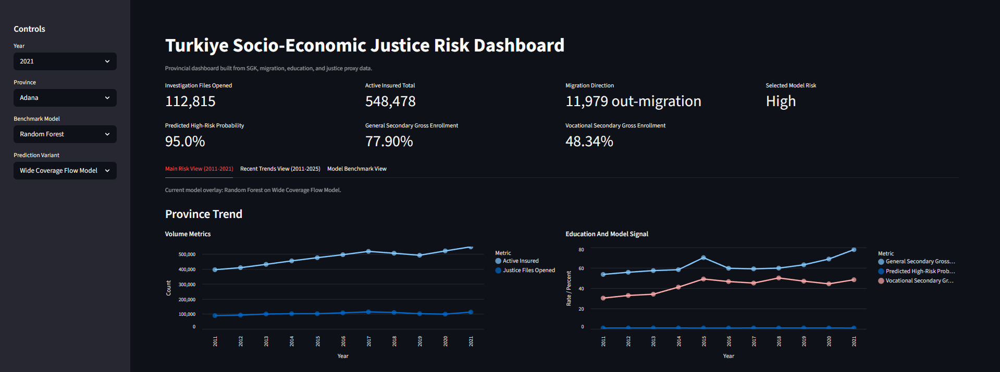
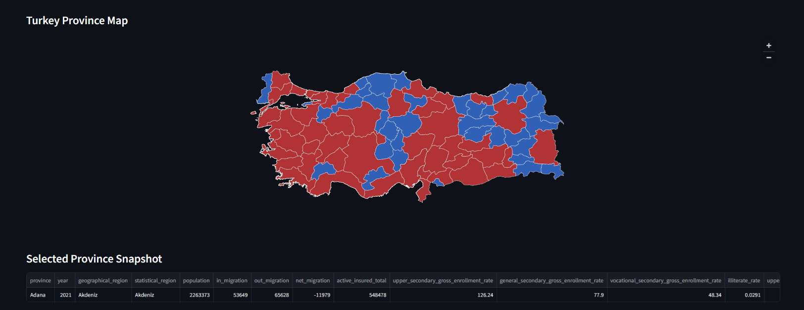
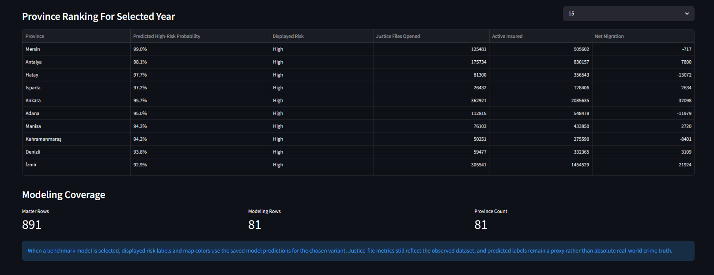

# Turkiye Socioeconomic Justice Risk Analysis

Province-level socio-economic analysis and justice-risk modeling project for Turkiye, built with official public datasets and an interactive Streamlit dashboard.

## Overview

This project studies how province-level socio-economic indicators relate to recorded justice-file intensity in Turkiye.

The system combines:

- provincial justice investigation statistics
- SGK active insured counts
- migration indicators
- education indicators from both TURKSTAT and MEB
- an interactive dashboard for province and year comparisons

The project does **not** claim to measure absolute crime truth directly.  
Its main target is a **justice proxy** based on recorded investigation-file volume.

## Problem Definition

The core modeling question is:

> Can province-level socio-economic indicators help explain or classify recorded justice-file intensity across Turkish provinces?

In the current implementation, the strongest province-level target is:

- `investigation_files_opened`

This target comes from provincial chief public prosecutor statistics and is used to derive yearly `Low / Medium / High` justice-risk bands.

## Dataset Summary

The harmonized baseline modeling window is:

- `2011-2021`

This window was selected because it is the cleanest province-level overlap across the main justice and socio-economic sources.

### Main Sources

- `Justice`: provincial investigation-file statistics, `2011-2021`
- `SGK`: active insured totals, `2009-2024`
- `Migration`: in-migration, out-migration, net migration, province population
- `TURKSTAT education`: attainment-style indicators for recent years
- `MEB education`: province-level gross enrollment ratios for upper secondary education, `2011-2025`

### Current Feature Groups

- `active_insured_total`
- `population`
- `in_migration`, `out_migration`, `net_migration`
- `general_secondary_gross_enrollment_rate`
- `vocational_secondary_gross_enrollment_rate`
- `illiterate_rate`
- `university_rate`
- region-based categorical indicators

### Important Interpretation Note

MEB education variables in this repository are **gross enrollment rates**, not attainment rates.

That means:

- values may exceed `100`
- they should be interpreted as enrollment intensity / participation proxies
- they should not be interpreted as direct graduation or attainment levels

## Modeling Approach

The repository currently includes two baseline model variants:

### 1. Rich Feature Rate Model

- narrower overlap
- richer socio-economic feature set
- useful for detailed cross-sectional analysis

### 2. Wide Coverage Flow Model

- broader temporal coverage
- stronger support across `2011-2021`
- currently the most stable baseline for wide province-year analysis

The `Wide Coverage Flow Model` is the stronger general-purpose baseline at the moment because it retains much broader data support.

## Methods

The project currently uses the following data science and machine learning methods:

- province-year panel data construction from multi-source public datasets
- data cleaning, province-name normalization, and schema harmonization
- feature engineering for migration, employment, population, and education indicators
- proxy-target modeling using recorded justice investigation intensity
- binary classification and yearly risk-band generation
- benchmark-based baseline modeling with logistic regression, random forest, and XGBoost
- missing-value imputation for numeric and categorical variables
- feature scaling for numeric variables
- one-hot encoding for categorical regional variables
- train/test split evaluation
- stratified cross-validation for model stability checks
- benchmark result export to CSV and JSON for reproducibility
- interactive visual analytics through a Streamlit dashboard

## Model Benchmarking

`src/train.py` now benchmarks multiple classifiers for both modeling variants:

- `Logistic Regression`
- `Random Forest`
- `XGBoost` if the optional dependency is installed successfully

For each variant, the training script performs:

- a stratified train/test split
- stratified cross-validation with up to `5` folds
- test-set reporting for accuracy, balanced accuracy, precision, recall, F1, and ROC-AUC
- confusion matrix and detailed classification report export
- out-of-fold prediction export for safer dashboard probability display

The current benchmark outputs are written to:

- `models/benchmark_summary.csv`
- `models/benchmark_results.json`
- `models/model_predictions.csv`

This makes it easier to compare whether the simpler linear baseline or the tree-based models generalize better for each province-year target definition.

## Dashboard

The Streamlit dashboard includes:

- province and year selection
- benchmarked model selection for comparison
- variant selection for switching between saved model overlays
- justice-risk metrics for the selected province
- province-level trend charts
- choropleth map of Turkish provinces
- province ranking for the selected year
- a recent monitoring view for post-2021 SGK and MEB trends
- a model benchmark view for comparing test and cross-validation performance

When benchmark artifacts are available, the dashboard can also switch its displayed risk overlay using the selected model and modeling variant. In that mode, map colors, displayed risk labels, probability cards, and the yearly province ranking are driven by saved out-of-fold model predictions rather than in-sample fitted probabilities.

The dashboard is intentionally split into two views:

- `Main Risk View (2011-2021)`
- `Recent Trends View (2011-2025)`

This keeps the main methodology clean while still exposing newer education and employment trends.

## Dashboard Preview

The current dashboard provides province-level justice-risk monitoring, socio-economic trend analysis, and comparative provincial views.

### Dashboard Overview



### Province Risk Map



### Ranking and Coverage



## Project Structure

```text
.
|-- app.py
|-- requirements.txt
|-- README.md
|-- data/
|   |-- external/
|   |-- raw/
|   `-- processed/
|-- docs/
|   |-- data_sources.md
|   |-- dataset_inventory.md
|   |-- raw_data_plan.md
|   `-- processed_data_plan.md
|-- models/
|-- notebooks/
|-- reports/
|-- src/
|   |-- config.py
|   |-- merge_master_data.py
|   |-- prepare_raw_data.py
|   |-- source_inventory.py
|   `-- train.py
`-- tests/
```

## How To Run

Create and activate a virtual environment:

```bash
git clone <repository-url>
cd Turkiye-Socioeconomic-Justice-Risk-Analysis
python -m venv .venv
.venv\Scripts\activate
pip install -r requirements.txt
```

Build the raw and processed datasets:

```bash
python src/prepare_raw_data.py
python src/merge_master_data.py
```

Train the benchmark models:

```bash
python src/train.py
```

If `XGBoost` is not available in your environment yet, install dependencies again after updating `requirements.txt`:

```bash
pip install -r requirements.txt
```

Run the dashboard:

```bash
streamlit run app.py
```

## Current Outputs

Generated raw datasets include:

- `data/raw/justice_provincial_2011_2021.csv`
- `data/raw/sgk_active_insured_2009_2024.csv`
- `data/raw/migration_provincial.csv`
- `data/raw/education_provincial_2021_2024.csv`
- `data/raw/meb_secondary_gross_enrollment_2011_2025.csv`

Generated processed datasets include:

- `data/processed/province_year_master_2011_2021.csv`
- `data/processed/province_year_modeling_2011_2021.csv`

Generated model benchmark outputs include:

- `models/benchmark_summary.csv`
- `models/benchmark_results.json`
- `models/model_predictions.csv`

## Limitations

- The project uses a **justice proxy**, not direct crime truth.
- The strongest province-level justice target currently ends at `2021`.
- Some richer socio-economic features are only available for narrower year ranges.
- Newer post-2021 trends are currently presented as monitoring views rather than unified justice-risk labels.

## Validation Notes

- Cross-validation is currently stratified to preserve class balance across folds.
- The rich-feature model has a much smaller sample size than the wide-coverage model, so cross-validation is especially important there.
- Tree-based models may fit non-linear province-level patterns better, but their gains should be interpreted together with cross-validation stability, not only a single test split.

## Future Improvements

- add hyperparameter tuning on top of the current benchmark baselines
- refine model interpretation and province-level explainability
- revisit smoother map interactivity in the final frontend polish stage
- remove temporary internal planning files before final public release

## License

This project includes an MIT license file in the repository.
